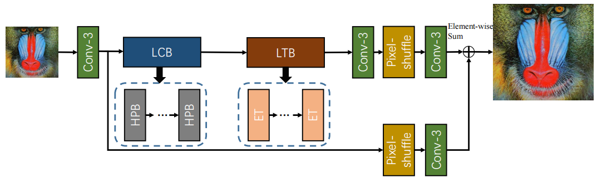
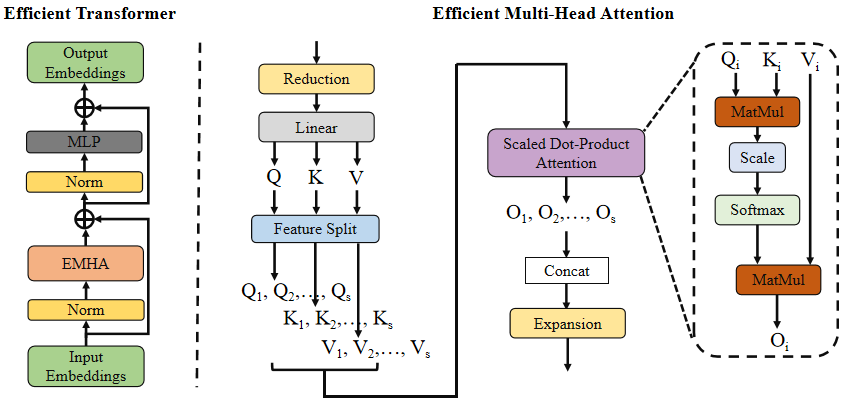

## Super Resolution on Edge device

model we compared:
    Bicubic ++
    ESRT
    
# ESRT
Efficient Transformer for Single Image
Super-Resolution

## Model

      
    <em> The overall architecture of the proposed Efficient SR Transformer (ESRT). </em>

      
    <em> Efficient Transformer and Efficient Multi-Head Attention. </em>

# Deployment
* Language: Kotlin, JAVA

* Platform: Android

* Description: an Android application to deploy the model by using the .pt file. Now it can smoothly handle the image that size < 200*200 and compare the two images in the interface.

### Example:

